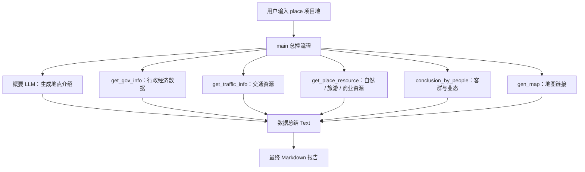
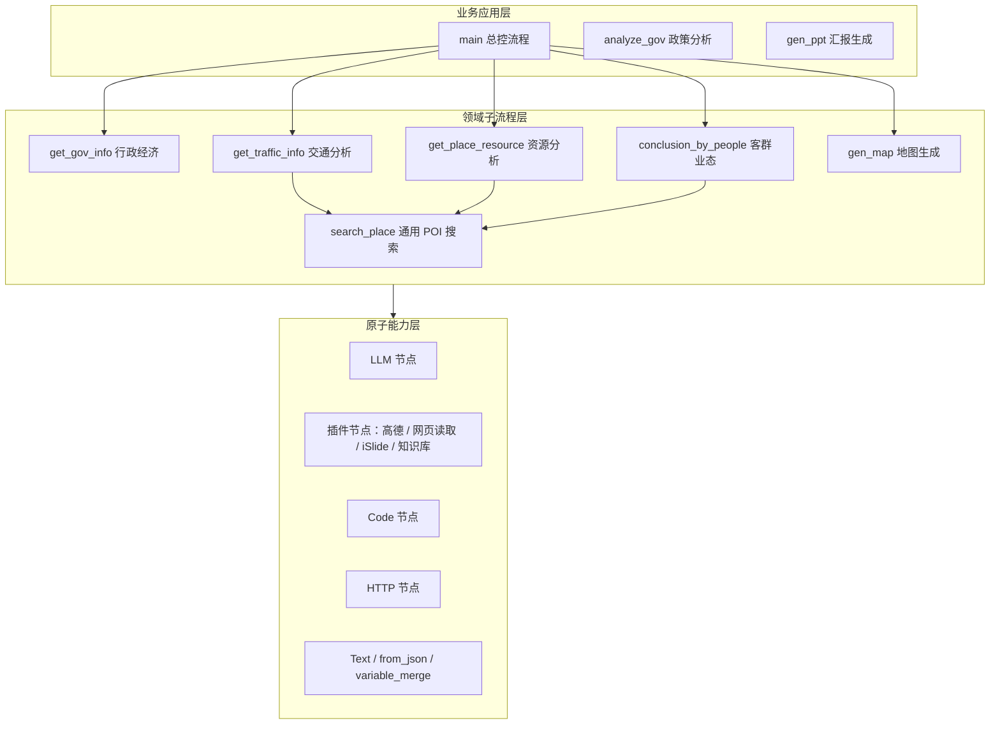
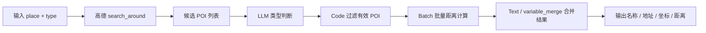

# 扣子工作流核心流程与封装实现说明

> 面向项目地选址 / 策划分析的多工作流编排说明  
> 生成日期：2026年7月1日

---

<style>
.coze-note {
  margin: 1.6rem 0 2.4rem;
}
.coze-note .hero,
.coze-note .card,
.coze-note .viewer,
.coze-note .tips {
  border: 1px solid #e4e8ef;
  border-radius: 16px;
  background: linear-gradient(180deg, #ffffff 0%, #f8fbff 100%);
  box-shadow: 0 10px 30px rgba(30, 60, 90, 0.08);
}
.coze-note .hero {
  padding: 1.4rem 1.5rem;
}
.coze-note .hero h2,
.coze-note .viewer h3,
.coze-note .card h3,
.coze-note .tips h3 {
  margin-top: 0;
}
.coze-note .hero-grid,
.coze-note .card-grid {
  display: grid;
  gap: 14px;
}
.coze-note .hero-grid {
  grid-template-columns: repeat(auto-fit, minmax(220px, 1fr));
  margin-top: 1rem;
}
.coze-note .card-grid {
  grid-template-columns: repeat(auto-fit, minmax(240px, 1fr));
  margin: 1rem 0 1.2rem;
}
.coze-note .hero-item,
.coze-note .card {
  padding: 1rem 1.1rem;
  background: #fff;
}
.coze-note .hero-item strong,
.coze-note .card strong {
  display: block;
  margin-bottom: 0.45rem;
  color: #1f2d3d;
}
.coze-note .viewer {
  padding: 1.1rem 1.2rem;
  margin-top: 1rem;
}
.coze-note .workflow-item {
  border: 1px solid #e7ebf2;
  border-radius: 12px;
  background: #fff;
  padding: 0.8rem 1rem;
  margin-top: 0.85rem;
}
.coze-note .viewer p {
  margin: 0.7rem 0;
}
.coze-note .links {
  display: flex;
  flex-wrap: wrap;
  gap: 8px;
  margin: 0.7rem 0;
}
.coze-note .links a {
  display: inline-flex;
  align-items: center;
  padding: 0.2rem 0.55rem;
  border: 1px solid #d7e6fb;
  border-radius: 999px;
  background: #f4f8ff;
  color: #1d4e89;
  text-decoration: none;
  font-size: 0.92rem;
}
.coze-note .links a:hover {
  background: #e9f2ff;
  text-decoration: none;
}
.coze-note .viewer h4 {
  margin: 0;
  color: #1d3557;
}
.coze-note .viewer iframe {
  width: 100%;
  height: 720px;
  border: 1px solid #d9e2ec;
  border-radius: 12px;
  background: #fff;
}
.coze-note .tips {
  padding: 1rem 1.2rem;
  margin-top: 1rem;
}
.coze-note .path {
  margin-top: 1rem;
  padding: 1rem 1.1rem;
  border-radius: 12px;
  background: #eef6ff;
  border: 1px solid #d7e6fb;
}
.coze-note .path strong {
  color: #16324f;
}
.coze-note .mini {
  color: #5b6b7f;
  font-size: 0.95rem;
}
.coze-note .result-demo {
  border: 1px solid #dfe7f1;
  border-radius: 14px;
  background: #fff;
  overflow: hidden;
  margin-top: 1rem;
}
.coze-note .result-demo-toggle {
  display: block;
  cursor: pointer;
  text-align: center;
  padding: 0.9rem 1.1rem 1rem;
  font-weight: 600;
  color: #1d4e89;
  background: #fff;
  border-top: 1px solid #edf2f8;
  width: 100%;
  appearance: none;
  -webkit-appearance: none;
  border-right: 0;
  border-bottom: 0;
  border-left: 0;
}
.coze-note .result-demo-head {
  padding: 0.95rem 1.1rem;
  background: linear-gradient(180deg, #f7fbff 0%, #eef5ff 100%);
  border-bottom: 1px solid #e4edf7;
}
.coze-note .result-demo-head strong {
  color: #17324d;
}
.coze-note .result-preview {
  position: relative;
  max-height: 360px;
  overflow: hidden;
  padding: 1.1rem 1.2rem 1.6rem;
}
.coze-note .result-demo.is-open .result-preview {
  max-height: none;
}
.coze-note .result-preview::after {
  content: "";
  position: absolute;
  left: 0;
  right: 0;
  bottom: 0;
  height: 120px;
  background: linear-gradient(180deg, rgba(255,255,255,0) 0%, rgba(255,255,255,0.92) 55%, #ffffff 100%);
}
.coze-note .result-demo.is-open .result-preview::after {
  display: none;
}
.coze-note .result-rendered h2,
.coze-note .result-rendered h3,
.coze-note .result-rendered h4 {
  color: #18324c;
}
.coze-note .result-rendered p,
.coze-note .result-rendered li {
  line-height: 1.8;
}
.coze-note .result-rendered ul,
.coze-note .result-rendered ol {
  padding-left: 1.35rem;
}
.coze-note .result-rendered a {
  word-break: break-all;
}
@media (max-width: 768px) {
  .coze-note .viewer iframe {
    height: 420px;
  }
  .coze-note .result-preview {
    max-height: 280px;
  }
}
</style>


<section class="coze-note">
  <div class="hero">
    <h2>项目速览</h2>
    <p>这是一个面向 <strong>城区规划</strong> 的 Coze Workflow 项目，围绕项目地选址、前策研判与汇报生成展开。当前项目已经实现地点介绍、行政经济分析、交通可达性分析、自然与商业资源分析、客群支撑分析、地图链接生成，以及最终 Markdown 报告拼接。</p>
    <div class="hero-grid">
      <div class="hero-item">
        <strong>封装边界清晰</strong>
        总控、领域子流程、原子能力三层拆分，避免把所有逻辑堆在一个大流程里。
      </div>
      <div class="hero-item">
        <strong>复用效率高</strong>
        <code>search_place</code> 这一通用搜索能力被交通、资源、客群等多个模块重复调用。
      </div>
      <div class="hero-item">
        <strong>获取数据</strong>
        分析网站特点，合理化获取对应的数据。
      </div>
    </div>
  </div>

  <div class="card-grid">
    <div class="card">
      <h3>应用场景</h3>
      <p>适用于城区规划中的项目初筛、区位研判、资源摸排、客群支撑分析。</p>
    </div>
  </div>

  <div class="tips">
    <h3>阅读建议</h3>
    <p>如果从产品视角阅读，建议先看 <code>main</code>，理解它如何把各模块结果组合成最终报告；如果从工程视角阅读，建议先看 <code>search_place</code>，因为它最能体现这套方案“把复用能力沉淀成标准接口”的封装思想。</p>
    <p class="mini">各工作流预览已移到下文对应说明章节中，便于边看结构说明边对照流程图。完整索引页：<a href="/assets/posts/coze-workflow/workflow/index.html" target="_blank" rel="noopener">打开 workflow 列表</a></p>
  </div>
</section>


## 目录

1. [总体定位与业务目标](#1-总体定位与业务目标)
2. [核心主流程 main 的运行链路及效果展示](#2-核心主流程-main-的运行链路及效果展示)
3. [工作流封装方式](#3-工作流封装方式)
4. [通用搜索子流程 search_place 的实现](#4-通用搜索子流程-search_place-的实现)
5. [行政经济数据 get_gov_info 的实现](#5-行政经济数据-get_gov_info-的实现)
6. [交通、资源与客群模块的实现](#6-交通资源与客群模块的实现)
7. [地图生成与 PPT / 政策分析扩展](#7-地图生成与-ppt--政策分析扩展)
8. [输出格式与数据流转机制](#8-输出格式与数据流转机制)
9. [核心工作流清单](#9-核心工作流清单)

---

## 1. 总体定位与业务目标

这套扣子工作流本质上是一个**项目地综合研判助手**。它以用户输入的项目地点为唯一主入口，自动拆解为行政经济、交通可达性、自然与旅游资源、商业及客群业态、地图可视化、政策合规、汇报 PPT 等多个子任务，再将各子任务输出聚合成一份可直接用于项目策划或汇报的 Markdown 分析报告。

核心特点：

- **业务输入极简**：用户只需要提供 `place`，即项目地名称、地址或地标。
- **业务拆解清晰**：不同信息类型分别由独立子工作流负责，避免单个大模型节点承担全部逻辑。
- **能力复用明显**：`search_place` 被交通、自然资源、商业资源、人群业态等多个流程复用。
- **输出面向报告**：最终结果不是单纯数据，而是被 LLM 总结、分标题拼接后的策划文本。

### 图 1：主流程整体链路



---

## 2. 核心主流程 main 的运行链路及效果展示

`main` 是总控流程，负责接收项目地点、并行触发关键子流程、调用大模型对各模块结果进行二次总结，并用文本处理节点将所有结果拼接为统一报告。

| 阶段 | 节点 / 子流程 | 实现方式 | 结果 |
|---|---|---|---|
| 输入阶段 | 开始节点 | 定义 `place` 输入变量，作为所有子流程的共同参数。 | 项目地点 |
| 地点概要 | 概要 LLM | 根据 `place` 调用地点介绍提示词，生成不超过约 200 字的基本介绍。 | 基本介绍 |
| 行政经济 | `get_gov_info` | 传入 `place`，获取行政区域、人口、GDP、收入、老龄化、年龄结构等数据。 | 人口经济原始信息 |
| 交通分析 | `get_traffic_info` | 传入 `place`，调用通用地点搜索，分别检索公交 / 地铁、道路、枢纽。 | 交通资源信息 |
| 资源分析 | `get_place_resource` | 传入 `place`，检索自然、旅游、商业资源后交给 LLM 总结。 | 自然景区与商业资源 |
| 业态分析 | `conclusion_by_people` | 批量调用 `get_people_num`，获取学校、公司、医院、小区等人群支撑。 | 业态与客群信息 |
| 地图生成 | `gen_map` | 根据城市和项目地调用地图 API，返回周边、交通、旅游地图链接。 | 地图链接 |
| 最终拼接 | 数据总结 Text | 将介绍、地图、人口经济、交通、自然景区、业态拼成 Markdown。 | 最终 `summary` |

### main 最终输出模板

```markdown
## 介绍
{{概要}}

## 人口经济
{{人口经济总结}}

## 交通
{{交通总结}}

## 自然景区
{{自然景区总结}}

## 业态
{{业态总结}}
```


<section class="coze-note">
  <div class="viewer">
    <h3><code>main</code> 总控流程展示</h3>
    <p class="mini">这一流程负责把介绍、行政经济、交通、资源、客群、地图等模块统一编排为最终分析报告。</p>
    <div class="workflow-item">
      <h4><code>main</code> 总控流程：从一个 <code>place</code> 输入出发，统一编排各业务模块</h4>
      <p><strong>复用模块：</strong></p>
      <div class="links">
        <a href="/assets/posts/coze-workflow/workflow/get_gov_info_-_%E5%B7%A5%E4%BD%9C%E6%B5%81_-%E6%99%BA%E8%83%BD%E4%BD%93%E5%B9%B3%E5%8F%B0/workflow_standalone.html" target="_blank" rel="noopener">get_gov_info</a>
        <a href="/assets/posts/coze-workflow/workflow/get_traffic_info_-_%E5%B7%A5%E4%BD%9C%E6%B5%81_-%E6%99%BA%E8%83%BD%E4%BD%93%E5%B9%B3%E5%8F%B0/workflow_standalone.html" target="_blank" rel="noopener">get_traffic_info</a>
        <a href="/assets/posts/coze-workflow/workflow/get_place_resource_-_%E5%B7%A5%E4%BD%9C%E6%B5%81_-%E6%99%BA%E8%83%BD%E4%BD%93%E5%B9%B3%E5%8F%B0/workflow_standalone.html" target="_blank" rel="noopener">get_place_resource</a>
        <a href="/assets/posts/coze-workflow/workflow/conclusion_by_people_-_%E5%B7%A5%E4%BD%9C%E6%B5%81_-%E6%99%BA%E8%83%BD%E4%BD%93%E5%B9%B3%E5%8F%B0/workflow_standalone.html" target="_blank" rel="noopener">conclusion_by_people</a>
        <a href="/assets/posts/coze-workflow/workflow/gen_map_-_%E5%B7%A5%E4%BD%9C%E6%B5%81_-%E6%99%BA%E8%83%BD%E4%BD%93%E5%B9%B3%E5%8F%B0/workflow_standalone.html" target="_blank" rel="noopener">gen_map</a>
      </div>
      <p><a href="/assets/posts/coze-workflow/workflow/main_-_%E5%B7%A5%E4%BD%9C%E6%B5%81_-%E6%99%BA%E8%83%BD%E4%BD%93%E5%B9%B3%E5%8F%B0/workflow_standalone.html" target="_blank" rel="noopener">打开 main 独立视图</a></p>
      <iframe loading="lazy" src="/assets/posts/coze-workflow/workflow/main_-_%E5%B7%A5%E4%BD%9C%E6%B5%81_-%E6%99%BA%E8%83%BD%E4%BD%93%E5%B9%B3%E5%8F%B0/workflow_standalone.html" title="main workflow"></iframe>
    </div>

    <div class="result-demo" id="main-result-demo">
      <div class="result-demo-head">
        <strong><code>main</code> 最终输出效果展示</strong>
      </div>
      <div class="result-preview">
        <div class="result-rendered">
          <p class="mini">以下内容对应新增流程目录 <a href="/assets/posts/coze-workflow/workflow/main%E7%BB%93%E6%9E%9C_-_%E5%B7%A5%E4%BD%9C%E6%B5%81_-%E6%99%BA%E8%83%BD%E4%BD%93%E5%B9%B3%E5%8F%B0/workflow_standalone.html" target="_blank" rel="noopener">main结果</a> 👈 点击左或下方可直接查看结果</p>

          <h2>介绍</h2>
          <p><strong>基本介绍</strong>：长沙市后湖艺术园区位于岳麓山脚下、大学城中心。它由老毛纺厂改建而来，有类似北京 798 艺术区的背景。这里被打造成生态治理示范区，集原创艺术创作交易、文化展示、休闲娱乐于一体。园区内有美术馆和培训中心，还定期举办“后湖·艺耕”草坪艺术季等文化活动，是长沙重要的文化艺术地标。 ^^</p>

          <h2>人口经济</h2>
          <h3>人口数据总结</h3>
          <p>根据第七次全国人口普查结果，2020年岳麓区常住人口为1526641人，0 - 14岁、15 - 64岁、65岁及以上人口比重分别为16.93%、75.06%、8.01%，性别比为98.24（女 = 100），城镇人口1436865人，乡村人口89776人^^国家统计局发布的第七次全国人口普查公报^^。</p>

          <h3>GDP数据总结</h3>
          <p>2022年岳麓区地区生产总值（GDP）1326.86亿元，同比增长4.3%。2020年第一产业增加值111292万元，第二产业增加值3823059万元。2022年城镇居民人均可支配收入65478元，同比增长4.2%，农村居民人均可支配收入42675元，同比增长6.6%^^岳麓区人民政府官网发布的《2022年岳麓区国民经济和社会发展统计公报》^^。</p>

          <h3>关联结论</h3>
          <p>岳麓区劳动年龄人口占比较高，为经济发展提供充足劳动力，推动2022年GDP增长4.3%。同时，居民收入增长利于拉动消费，进一步促进经济发展。</p>

          <h2>交通</h2>
          <ol>
            <li><strong>项目地址</strong>：未明确给出项目地址，推测分析范围基于上述公交站、地铁站及交通枢纽信息所涉及区域（用户提供相关位置信息）。</li>
            <li><strong>数据整理</strong>：
              <ul>
                <li><strong>公交覆盖</strong>：项目周边500 - 700米内有5个公交站，途经线路包括202路、315路、360路、913路、156路、205路等。距离较远（2000 - 3000米）的公交站有中南大学学生公寓、腌鱼塘、磨子山、沙泥塘等站，线路有360路、913路、大科城2号线、大科城4号线、立珊专线等（用户提供）。</li>
                <li><strong>地铁信息</strong>：最近的地铁站为中南大学站，步行距离2235米，途经3号线。距离稍近的阜埠河站步行距离2147米，可换乘3号线和4号线；阳光站步行距离2750米，途经3号线（用户提供）。</li>
                <li><strong>交通枢纽</strong>：距离湘江大码头1246米，鹿港码头2141米（用户提供）。</li>
              </ul>
            </li>
            <li><strong>综合结论</strong>：项目地公共交通可达性评分4.5/10，<strong>优势</strong>在于周边一定范围内有较多公交站且线路丰富，可选择的出行线路较多。<strong>待优化</strong>：地铁步行距离较远，500米内公交站覆盖数量有限。建议在项目周边增设500米内的公交站点，同时考虑设置直达地铁的便民摆渡车（基于用户提供的公交站和地铁站分布数据）。</li>
          </ol>

          <h2>自然景区</h2>
          <p>核心分析方向为项目地的自然资源与景区资源情况。</p>
          <ul>
            <li><strong>自然资源</strong>：有阜埠河，位于岳麓区，经纬度112.950610,28.164865，间隔距离2632米。</li>
            <li><strong>景区资源</strong>：包含实竹塘土地庙、五彩栈道等多个景观，有自然景观如中南大学潇湘校区天鹅湖，也有人文景观如实竹塘土地庙，多分布在岳麓区周边。</li>
          </ul>
          <p><strong>核心优势</strong>：区域内自然与人文景观丰富。<strong>开发潜力</strong>：生态旅游开发潜力评级：中。<strong>保护建议</strong>：建议加强对阜埠河的生态保护，合理规划景区开发，避免过度开发。<strong>结论</strong>：岳麓区有阜埠河等自然资源，及众多景区资源，景观类型丰富（数据来源：用户提供信息），可适度发展生态旅游，同时注重河流生态保护。</p>

          <h2>业态</h2>
          <h3>基础信息</h3>
          <ul>
            <li><strong>项目地址</strong>：长沙市后湖艺术园区</li>
            <li><strong>分析时效需求</strong>：未提及，按照最新提供的数据进行分析</li>
            <li><strong>额外补充分析维度</strong>：未提及，按默认四大资源类型（商业、医疗、教育、居住）分析</li>
          </ul>

          <h3>各资源分析</h3>
          <h4>商业资源分析</h4>
          <ul>
            <li><strong>数据整合</strong>：
              <ul>
                <li>公司数量：共统计到14家公司，总人数246人，但部分公司人数未查询到。</li>
                <li>类型：涵盖营销策划、健康管理、文化传媒、建筑装饰、物联科技等多种类型。</li>
                <li>品牌构成：由于缺乏品牌相关信息，暂无法分析连锁/本地品牌占比。</li>
                <li>规划进度：无相关数据。</li>
                <li>典型品牌入驻情况：无明显典型品牌相关信息。</li>
                <li>租金水平、销售额趋势：无相关公开数据。</li>
              </ul>
            </li>
            <li><strong>分类拆解分析</strong>：
              <ul>
                <li>品类覆盖度：从公司类型来看，涉及营销、健康、文化、建筑等领域，但缺乏购物、餐饮等传统商业业态，夜间经济等空白领域明显。</li>
                <li>配套密度：由于缺乏区域面积数据，无法计算单位面积内商业设施数量，难以对比区域平均水平。</li>
              </ul>
            </li>
          </ul>

          <h4>医疗资源分析</h4>
          <ul>
            <li><strong>数据整合</strong>：
              <ul>
                <li>医院数量：共统计到15家医疗机构，总人数182人，但部分机构人数未查询到。</li>
                <li>等级：有1家三级医院（中南大学岳麓山校区校医院），多家一级及以下医院和卫生服务站。</li>
                <li>床位数：无相关数据。</li>
                <li>重点科室分布：无相关数据。</li>
                <li>距离差异：由于未给出各小区到医院的距离，无法分析。</li>
              </ul>
            </li>
            <li><strong>分类拆解分析</strong>：
              <ul>
                <li>可及性：缺乏各小区到医院的步行/车行时间数据，无法分析。</li>
                <li>层级结构：头部医疗资源（三级医院）仅有1家，基础医疗资源（社区卫生服务站等）相对较多，供给结构基本合理，但可能存在部分区域覆盖不足的情况。</li>
              </ul>
            </li>
          </ul>

          <h4>教育资源分析</h4>
          <ul>
            <li><strong>数据整合</strong>：
              <ul>
                <li>学校数量：共统计到21所学校，总人数91283人，其中小学7所，人数4162人；中学6所，人数9340人；大学8所，人数77781人。</li>
                <li>师资力量：无相关数据。</li>
                <li>升学率：无相关数据。</li>
                <li>招生范围：无相关数据。</li>
                <li>特色教育资源：有网上老年大学湖南校友会、一墨塾日语·韩语·留学·自习室、天星高考等特色教育资源。</li>
              </ul>
            </li>
            <li><strong>分类拆解分析</strong>：
              <ul>
                <li>学段适配：涵盖了小学、中学、大学等全年龄段教育，但幼小衔接、课后托管等配套可能存在缺口。</li>
                <li>质量评估：由于缺乏升学率、师资学历等数据，无法进行质量评估。</li>
              </ul>
            </li>
          </ul>

          <h4>居住资源分析</h4>
          <ul>
            <li><strong>数据整合</strong>：
              <ul>
                <li>小区数量：共统计到15个小区，但总人数显示为0，部分小区人数未查询到。</li>
                <li>人口密度：无相关数据。</li>
                <li>户型结构：无相关数据。</li>
                <li>房价/租金波动趋势：无相关数据。</li>
                <li>居住人口职业结构：无相关数据。</li>
              </ul>
            </li>
            <li><strong>分类拆解分析</strong>：
              <ul>
                <li>居住人口画像：由于缺乏常住人口年龄结构、收入水平等数据，无法进行画像分析。</li>
                <li>社区成熟度：由于缺乏新建/老旧小区占比等数据，无法分析居住配套缺口。</li>
              </ul>
            </li>
          </ul>

          <h3>资源匹配度分析</h3>
          <ul>
            <li>以居住人口规模为基准（虽然本次数据中居住人口总人数显示为0，但园区内实际应有居住人口），商业资源方面，目前商业业态不够丰富，难以满足居民的消费需求；医疗资源方面，基础医疗资源相对较多，但头部医疗资源较少，可能无法满足居民的大病就医需求；教育资源丰富，涵盖了全年龄段教育，但可能在幼小衔接、课后托管等方面存在不足；居住资源方面，由于数据缺失，无法准确评估居住资源与其他资源的匹配度。</li>
            <li>短板识别：商业资源品类覆盖不足，夜间经济、高端商业等业态缺失；医疗资源中头部医疗资源较少；教育资源在幼小衔接、课后托管等方面可能存在缺口；居住资源数据缺失严重，无法准确评估。</li>
          </ul>

          <h3>结论输出</h3>
          <h4>商业资源</h4>
          <ul>
            <li><strong>核心数据</strong>：共14家公司，总人数246人（部分公司人数未查询），涉及多种类型公司。</li>
            <li><strong>现状评估</strong>：商业业态不够丰富，缺乏购物、餐饮等传统商业业态，夜间经济等存在空白。</li>
            <li><strong>潜在优化点</strong>：引入购物、餐饮等商业业态，发展夜间经济，丰富商业品类。</li>
          </ul>

          <h4>医疗资源</h4>
          <ul>
            <li><strong>核心数据</strong>：15家医疗机构，总人数182人（部分机构人数未查询），有1家三级医院。</li>
            <li><strong>现状评估</strong>：基础医疗资源相对较多，头部医疗资源较少，可能存在部分区域覆盖不足。</li>
            <li><strong>潜在优化点</strong>：适当增加大型综合医院等头部医疗资源，优化医疗资源布局。</li>
          </ul>

          <h4>教育资源</h4>
          <ul>
            <li><strong>核心数据</strong>：21所学校，总人数91283人，涵盖小学、中学、大学。</li>
            <li><strong>现状评估</strong>：教育资源丰富，但幼小衔接、课后托管等配套可能存在缺口。</li>
            <li><strong>潜在优化点</strong>：引入专业的幼小衔接机构和课后托管服务。</li>
          </ul>

          <h4>居住资源</h4>
          <ul>
            <li><strong>核心数据</strong>：15个小区，总人数显示为0（部分小区人数未查询）。</li>
            <li><strong>现状评估</strong>：由于数据缺失，无法准确评估居住资源现状。</li>
            <li><strong>潜在优化点</strong>：补充小区人口、户型、房价、租金等数据，以便更好地评估居住资源与其他资源的匹配度。</li>
          </ul>

          <h4>综合结论</h4>
          <ul>
            <li><strong>资源密度评分</strong>：商业资源3分，医疗资源4分，教育资源6分，居住资源因数据缺失难以评分。</li>
            <li><strong>优势领域</strong>：教育资源丰富，涵盖全年龄段。</li>
            <li><strong>待补短板</strong>：商业资源品类不足，医疗资源中头部资源较少，教育资源幼小衔接和课后托管配套不足，居住资源数据缺失。</li>
            <li><strong>建议方向</strong>：丰富商业业态，增加头部医疗资源，完善教育配套，补充居住资源数据。</li>
          </ul>
        </div>
      </div>
      <button
        class="result-demo-toggle"
        type="button"
        aria-expanded="false"
        onclick="var box=this.parentNode; var open=box.classList.toggle('is-open'); this.setAttribute('aria-expanded', open ? 'true' : 'false'); this.textContent = open ? '收起内容' : '展开全文';"
      >展开全文</button>
    </div>
  </div>
</section>


---

## 3. 工作流封装方式

整套工作流采用 **“总控流程 + 子工作流 + 原子节点能力”** 的封装方式。总控流程不直接处理所有细节，而是把稳定且可复用的能力沉淀成独立工作流，再通过 `subflow` 节点调用。

### 图 2：工作流封装层次



| 封装层 | 代表节点 / 流程 | 职责 | 复用价值 |
|---|---|---|---|
| 原子能力层 | LLM 节点 | 负责介绍、提取、验证、总结、结构化输出。 | 用提示词封装认知逻辑 |
| 原子能力层 | 插件节点 | 调用高德地图、网页读取、PPT 生成、知识库等外部能力。 | 把外部 API 能力标准化为节点 |
| 原子能力层 | Code 节点 | 进行 JSON 组装、数组过滤、缩略图列表转换等确定性处理。 | 避免把确定性逻辑交给大模型 |
| 原子能力层 | HTTP 节点 | 调用自建地图生成接口，返回地图 URL。 | 连接外部服务 |
| 领域子流程层 | `search_place` | 封装 POI 搜索、类型校验、距离计算、结果格式化。 | 交通 / 资源 / 业态均可复用 |
| 领域子流程层 | `get_gov_info` 等 | 封装特定领域的数据获取与清洗逻辑。 | 降低 `main` 的复杂度 |
| 业务应用层 | `main` | 编排各领域子流程并生成最终报告。 | 形成面向用户的完整应用 |
| 业务应用层 | `analyze_gov` / `gen_ppt` | 作为扩展工作流，补充政策合规与汇报输出能力。 | 可按需接入主链路 |

---

## 4. 通用搜索子流程 search_place 的实现

`search_place` 是整套系统中最核心的复用型子工作流。它把“搜索某地点附近某类资源”这件事封装为统一接口：输入 `place` 和 `type`，输出满足类型要求的周边地点名称、坐标、地址及距离描述。

### 图 3：search_place 通用搜索封装



| 步骤 | 实现节点 | 具体逻辑 |
|---|---|---|
| 1. 周边搜索 | 高德 `search_around` 插件 | 根据 `place + type` 搜索附近 POI，得到候选地点列表。 |
| 2. 类型判断 | LLM 节点 | 对候选 POI 进行语义校验，判断是否真的属于输入的 `type`。 |
| 3. 代码过滤 | Code 节点 | 将 LLM 判定有效的 `name` 数组与原始 POI 列表做交集，只保留有效项。 |
| 4. 批量距离计算 | Batch + `plan_driving` / `plan_walking` | 对每个有效 POI 执行路线距离或步行 / 驾车距离计算。 |
| 5. 结果合并 | Text / `variable_merge` | 将地点、地址、坐标、距离处理为可读文本。 |

### search_place 的接口抽象

```text
输入：
- place：项目地
- type：资源类型，例如 公交站、地铁站、山脉、商场、学校、医院

输出：
- POI 名称
- 经纬度 location
- 地址 address
- 与项目地的距离 / 路线信息
```

这个封装使上层流程无需关心高德插件的返回结构，也无需重复编写过滤、验证、距离计算逻辑。任何新模块只要给出新的 `type`，就可以复用相同的搜索能力。


<section class="coze-note">
  <div class="viewer">
    <h3><code>search_place</code> 通用搜索流程展示</h3>
    <div class="workflow-item">
      <h4><code>search_place</code> 通用搜索能力：所有业务模块共同复用的底层封装</h4>
      <p><strong>看点：</strong> 统一完成地点搜索、类型校验、距离计算和结果格式化，供多个业务模块复用。</p>
      <p><a href="/assets/posts/coze-workflow/workflow/search_place_-_%E5%B7%A5%E4%BD%9C%E6%B5%81_-%E6%99%BA%E8%83%BD%E4%BD%93%E5%B9%B3%E5%8F%B0/workflow_standalone.html" target="_blank" rel="noopener">打开 search_place 独立视图</a></p>
      <iframe loading="lazy" src="/assets/posts/coze-workflow/workflow/search_place_-_%E5%B7%A5%E4%BD%9C%E6%B5%81_-%E6%99%BA%E8%83%BD%E4%BD%93%E5%B9%B3%E5%8F%B0/workflow_standalone.html" title="search_place workflow"></iframe>
    </div>
  </div>
</section>


---

## 5. 行政经济数据 get_gov_info 的实现

`get_gov_info` 负责将用户输入的具体地点转换为行政区，并围绕该行政区获取人口、经济、面积、收入、老龄化、年龄结构等基础数据。它的特点是同时使用地图插件、网页读取、知识库表格和大模型提取。

| 子步骤 | 节点 / 能力 | 实现说明 |
|---|---|---|
| 地址标准化 | `poi_to_geocode` + LLM 获取区域信息 | 先把项目地转换为更标准的地址 / 行政单位，再由 LLM 提取最小行政区域。 |
| 人口普查链接获取 | 网页读取 + LLM 获取人口普查链接 | 根据行政区检索人口普查或统计公报链接，若找到链接则进入网页读取分支。 |
| 网页内容抽取 | `LinkReader` / `read_web_content` + LLM | 读取网页内容后，抽取常住人口、户籍人口、GDP、收入、老龄化等数据。 |
| 兜底联网搜索 | LLM 直接联网搜索 | 如果未能拿到有效链接，则直接搜索近三年内的公开数据，要求输出数据项与依据。 |
| 知识库补充 | 县域统计年鉴 / 第七次人口普查资料 | 通过表格知识库补充地区经济和人口结构数据。 |
| 结果拼接 | Text 节点 | 把不同来源的数据表格和文本整合输出。 |

实现要点：

- 该流程的核心不是简单搜索，而是 **“行政区识别 → 可信来源读取 → 多分支兜底 → 结构化提取”**。
- LLM 的角色主要是从长文本或网页内容中提取字段，并整理为 Markdown 表格。
- 如果要提高稳定性，建议把每个数据项输出为：**数值、年份、来源链接、口径说明**。


<section class="coze-note">
  <div class="viewer">
    <h3><code>get_gov_info</code> 行政经济流程展示</h3>
    <div class="workflow-item">
      <h4><code>get_gov_info</code> 行政经济模块：行政区识别、多来源抽取与兜底搜索</h4>
      <p><strong>看点：</strong> 整合网页、知识库和结构化提取能力，输出行政区人口经济信息。</p>
      <p><a href="/assets/posts/coze-workflow/workflow/get_gov_info_-_%E5%B7%A5%E4%BD%9C%E6%B5%81_-%E6%99%BA%E8%83%BD%E4%BD%93%E5%B9%B3%E5%8F%B0/workflow_standalone.html" target="_blank" rel="noopener">打开 get_gov_info 独立视图</a></p>
      <iframe loading="lazy" src="/assets/posts/coze-workflow/workflow/get_gov_info_-_%E5%B7%A5%E4%BD%9C%E6%B5%81_-%E6%99%BA%E8%83%BD%E4%BD%93%E5%B9%B3%E5%8F%B0/workflow_standalone.html" title="get_gov_info workflow"></iframe>
    </div>
  </div>
</section>


---

## 6. 交通、资源与客群模块的实现

### 6.1 get_traffic_info：交通可达性分析

交通模块本身不直接搜索所有 POI，而是把交通类型拆成三组后复用 `search_place`。它的输出先被文本节点整理成“城市内交通、周边道路、重要交通枢纽”三个小节，再由 LLM 做交通可达性总结。

| 资源组 | 调用方式 | 覆盖类型 |
|---|---|---|
| 公共交通 | `subflow search_place` | 公交站、地铁站等城市内部公共交通资源。 |
| 周边道路 | `subflow search_place` | 国道、省道、县道、村道等道路资源。 |
| 交通枢纽 | `subflow search_place` | 高铁站、火车站、机场、汽车站、港口等连接城区的枢纽。 |

#### get_traffic_info 的中间文本模板

```markdown
### 城市内交通情况
{{公共交通结果}}

### 周边道路情况（国道、省道、县道、村道）
{{道路结果}}

### 重要交通枢纽（连接城区）
{{枢纽结果}}
```

### 6.2 get_place_resource：自然、旅游、商业资源分析

资源模块把项目地周边资源拆为自然资源、旅游资源和商业资源三类，每类都调用 `search_place`，最后由一个 LLM 节点汇总资源名称、主要特征、位置信息和开发价值。

| 资源类型 | 子流程调用 | 示例 `type` |
|---|---|---|
| 自然资源 | `search_place` | 山脉、河流、湖泊、森林、田园、草坪 |
| 旅游资源 | `search_place` | 旅游景点、景区、文旅资源 |
| 商业资源 | `search_place` | 商场、商业中心、购物中心 |

### 6.3 conclusion_by_people / get_people_num：客群与业态支撑分析

客群模块采用 **“批处理 + 类型分支”** 的封装：`conclusion_by_people` 对学校、公司、医院、小区四类资源批量调用 `get_people_num`；`get_people_num` 再根据 `type` 走不同处理逻辑。

| 类型 | 实现方式 | 说明 |
|---|---|---|
| 学校 | 批处理 + `get_students_num` | 先搜索学校列表，再批量查询学生数量，最后汇总为学生客群规模。 |
| 医院 | 搜索医院 + LLM 查询医院类型及人数 | 对医院名单去重后，查询医院类型、床位 / 就诊或服务规模等信息，再进行汇总。 |
| 公司 | 搜索公司 + LLM 人数估算 / 汇总 | 检索附近公司并提取或估算办公人群规模。 |
| 小区 | 搜索小区 + LLM 人数估算 / 汇总 | 检索住宅小区并估算居住人口支撑。 |

实现要点：

- `conclusion_by_people` 的批处理列表固定为：学校、公司、医院、小区。
- `get_people_num` 内部通过选择器判断 `type`，学校和医院有特殊处理，其他类型走通用人数汇总逻辑。
- 学校人数查询被进一步封装为 `get_students_num`，便于批量查询学生人数并形成统一输出。


<section class="coze-note">
  <div class="viewer">
    <h3>交通、资源与客群流程展示</h3>
    <p class="mini">这一组流程都围绕统一输入展开，其中交通和资源模块直接复用 <code>search_place</code>，客群模块则在其上叠加批处理与分支逻辑。</p>

    <div class="workflow-item">
      <h4><code>get_traffic_info</code> 交通模块：把交通分析封装为独立业务子流程</h4>
      <p><strong>看点：</strong> 复用地点搜索能力，统一输出公交、地铁、道路、枢纽等交通可达性结果。</p>
      <p><strong>复用模块：</strong></p>
      <div class="links">
        <a href="/assets/posts/coze-workflow/workflow/search_place_-_%E5%B7%A5%E4%BD%9C%E6%B5%81_-%E6%99%BA%E8%83%BD%E4%BD%93%E5%B9%B3%E5%8F%B0/workflow_standalone.html" target="_blank" rel="noopener">search_place</a>
      </div>
      <p><a href="/assets/posts/coze-workflow/workflow/get_traffic_info_-_%E5%B7%A5%E4%BD%9C%E6%B5%81_-%E6%99%BA%E8%83%BD%E4%BD%93%E5%B9%B3%E5%8F%B0/workflow_standalone.html" target="_blank" rel="noopener">打开 get_traffic_info 独立视图</a></p>
      <iframe loading="lazy" src="/assets/posts/coze-workflow/workflow/get_traffic_info_-_%E5%B7%A5%E4%BD%9C%E6%B5%81_-%E6%99%BA%E8%83%BD%E4%BD%93%E5%B9%B3%E5%8F%B0/workflow_standalone.html" title="get_traffic_info workflow"></iframe>
    </div>

    <div class="workflow-item">
      <h4><code>get_place_resource</code> 资源模块：把自然、旅游、商业资源抽象成统一分析模式</h4>
      <p><strong>看点：</strong> 统一处理自然资源、旅游资源、商业资源三类对象，输出资源分布与开发价值。</p>
      <p><strong>复用模块：</strong></p>
      <div class="links">
        <a href="/assets/posts/coze-workflow/workflow/search_place_-_%E5%B7%A5%E4%BD%9C%E6%B5%81_-%E6%99%BA%E8%83%BD%E4%BD%93%E5%B9%B3%E5%8F%B0/workflow_standalone.html" target="_blank" rel="noopener">search_place</a>
      </div>
      <p><a href="/assets/posts/coze-workflow/workflow/get_place_resource_-_%E5%B7%A5%E4%BD%9C%E6%B5%81_-%E6%99%BA%E8%83%BD%E4%BD%93%E5%B9%B3%E5%8F%B0/workflow_standalone.html" target="_blank" rel="noopener">打开 get_place_resource 独立视图</a></p>
      <iframe loading="lazy" src="/assets/posts/coze-workflow/workflow/get_place_resource_-_%E5%B7%A5%E4%BD%9C%E6%B5%81_-%E6%99%BA%E8%83%BD%E4%BD%93%E5%B9%B3%E5%8F%B0/workflow_standalone.html" title="get_place_resource workflow"></iframe>
    </div>

    <div class="workflow-item">
      <h4><code>conclusion_by_people</code> 客群模块：通过批处理与分支逻辑复用多类人群分析</h4>
      <p><strong>看点：</strong> 统一分析学校、公司、医院、小区四类对象，输出客群支撑与业态判断结果。</p>
      <p><strong>复用模块：</strong></p>
      <div class="links">
        <a href="/assets/posts/coze-workflow/workflow/get_people_num_-_%E5%B7%A5%E4%BD%9C%E6%B5%81_-%E6%99%BA%E8%83%BD%E4%BD%93%E5%B9%B3%E5%8F%B0/workflow_standalone.html" target="_blank" rel="noopener">get_people_num</a>
        <a href="/assets/posts/coze-workflow/workflow/get_students_num_-_%E5%B7%A5%E4%BD%9C%E6%B5%81_-%E6%99%BA%E8%83%BD%E4%BD%93%E5%B9%B3%E5%8F%B0/workflow_standalone.html" target="_blank" rel="noopener">get_students_num</a>
        <a href="/assets/posts/coze-workflow/workflow/search_place_-_%E5%B7%A5%E4%BD%9C%E6%B5%81_-%E6%99%BA%E8%83%BD%E4%BD%93%E5%B9%B3%E5%8F%B0/workflow_standalone.html" target="_blank" rel="noopener">search_place</a>
      </div>
      <p><a href="/assets/posts/coze-workflow/workflow/conclusion_by_people_-_%E5%B7%A5%E4%BD%9C%E6%B5%81_-%E6%99%BA%E8%83%BD%E4%BD%93%E5%B9%B3%E5%8F%B0/workflow_standalone.html" target="_blank" rel="noopener">打开 conclusion_by_people 独立视图</a></p>
      <iframe loading="lazy" src="/assets/posts/coze-workflow/workflow/conclusion_by_people_-_%E5%B7%A5%E4%BD%9C%E6%B5%81_-%E6%99%BA%E8%83%BD%E4%BD%93%E5%B9%B3%E5%8F%B0/workflow_standalone.html" title="conclusion_by_people workflow"></iframe>
    </div>
  </div>
</section>


---

## 7. 地图生成与 PPT / 政策分析扩展

### 7.1 gen_map：地图生成功能

地图模块的目标是把项目地及周边资源转成地图页面链接。当前文章统一以 `gen_map` 指代这一地图流程，它通过按地图类型请求外部地图接口，并将结果整理为可直接打开的地图页面。

| 流程 | 核心实现 | 输出 |
|---|---|---|
| `gen_map` | 分别请求城市交通地图、地区附近地图、城市旅游地图接口，并反序列化返回 JSON。 | `around_map`、`city_traffic_map`、`city_tour_map` |
| `gen_map_Json` | 根据输入文本和 `type` 映射表，使用 LLM 结构化生成地图点位 JSON。 | 符合地图接口的点位数组或含 `center` 的地图 JSON |

#### gen_map 中 Code 节点组装的地图数据结构

```json
{
  "radius": 2000,
  "center": {
    "lat": "center_lat",
    "lng": "center_lng",
    "name": "center_name",
    "type": "center"
  },
  "points": "Json_map"
}
```

实现要点：

- 地图点位类型通过中英文映射统一，例如 `mountain`、`river`、`lake`、`tourism`、`mall`、`bus`、`subway`、`airport`、`hospital`、`residential` 等。
- HTTP 节点负责把结构化地图 JSON 发给外部地图服务，`from_json` 节点负责解析返回结果中的 URL 字段。
- 实际工程中建议将接口地址、鉴权 Header 等敏感配置迁移到环境变量或插件密钥配置中。


<section class="coze-note">
  <div class="viewer">
    <h3><code>gen_map</code> 地图流程展示</h3>
    <div class="workflow-item">
      <h4><code>gen_map</code> 地图生成流程：将点位数据转换为可交付地图页面</h4>
      <p><strong>看点：</strong> 通过结构化 JSON 与地图接口对接，把分析结果转为可直接打开的地图链接。</p>
      <p><a href="/assets/posts/coze-workflow/workflow/gen_map_-_%E5%B7%A5%E4%BD%9C%E6%B5%81_-%E6%99%BA%E8%83%BD%E4%BD%93%E5%B9%B3%E5%8F%B0/workflow_standalone.html" target="_blank" rel="noopener">打开 gen_map 独立视图</a></p>
    </div>
  </div>
</section>


### 7.2 gen_ppt：汇报 PPT 生成

`gen_ppt` 是独立扩展工作流，利用 iSlide 插件能力先生成大纲，再基于大纲生成演示文稿。随后 Code 节点遍历 PPT 页面数据，把每页 `thumbnail` 转为 Markdown 图片格式，用于在扣子对话中展示预览。

| 步骤 | 节点 | 实现说明 |
|---|---|---|
| 生成大纲 | `generate_outline` | 根据输入主题或主报告内容生成 PPT outline。 |
| 处理大纲 | `Code_1` | 当前代码存在调试痕迹，主要用于将 outline 作为 presentation 输入。 |
| 生成 PPT | `generate_presentation` | 调用 iSlide 插件生成 PPT 数据和页面缩略图。 |
| 输出预览 | Code + Text | 将 `data.pages[].thumbnail` 拼成 `` 列表。 |

### 7.3 analyze_gov：政策环境与合规性专章

`analyze_gov` 是政策分析扩展工作流，定位是围绕具体项目生成《政策环境与合规性分析》专章。它接收项目资料和用户需求，通过“城市更新政策库”进行知识库召回，并由 LLM 将国家、省、市、专项导则与项目逐条对应。

实现方式：

- 输入包括 `doc`（项目材料）与 `input`（用户具体需求）。
- 知识库检索用于召回政策依据，大模型用于组织“政策条款—项目对应—合规建议”的文本。
- 该模块适合接入 `main` 的后置阶段，作为报告中的政策分析章节。

---

## 8. 输出格式与数据流转机制

从技术实现看，这套工作流的数据流转并不是直接把所有插件结果暴露给用户，而是经过 **“原始结果 → 清洗 / 筛选 → 结构化 → LLM 总结 → 模板拼接”** 的多层处理。

| 数据阶段 | 典型节点 | 说明 |
|---|---|---|
| 原始输入 | Start | 用户输入 `place`、`type`、`city`、`destination`、`doc` 等变量。 |
| 外部检索 | 插件 / HTTP | 高德、网页读取、知识库、PPT 插件、地图接口等返回原始数据。 |
| 确定性处理 | Code / Text / `from_json` | 过滤数组、拼接 JSON、解析接口返回、格式化文本。 |
| 语义处理 | LLM | 完成介绍、提取、类型判断、数据总结、策略分析。 |
| 批量处理 | Batch | 对多类别、多 POI、多学校逐项执行同一逻辑。 |
| 结果聚合 | `variable_merge` / Text | 把不同分支合并，并按照报告结构输出。 |

### 输出结果分层

```text
主输出 summary 结构：
1. 介绍
2. 地图链接
3. 人口经济
4. 交通
5. 自然景区
6. 业态

扩展输出：
- 政策环境与合规性分析专章
- PPT 页面预览或 PPT 文件链接
- 地图 URL
```

---

## 9. 核心工作流清单

| 工作流 | 定位 | 核心实现 |
|---|---|---|
| `main` | 总控流程 | 接收 `place`，调用各子流程并拼接最终报告。 |
| `search_place` | 通用 POI 搜索 | 高德搜索 + LLM 类型验证 + Code 过滤 + 批量距离计算。 |
| `get_gov_info` | 行政经济数据 | 地址转行政区、网页 / 知识库 / 搜索获取人口经济数据。 |
| `get_traffic_info` | 交通资源 | 复用 `search_place` 获取公共交通、道路和枢纽信息。 |
| `get_place_resource` | 自然 / 旅游 / 商业资源 | 复用 `search_place` 检索三类资源并由 LLM 总结。 |
| `conclusion_by_people` | 人群业态总控 | 批量调用 `get_people_num` 分析学校、公司、医院、小区。 |
| `get_people_num` | 各类人群数量 | 按 `type` 分支处理学校、医院、公司、小区人数。 |
| `get_students_num` | 学校人数查询 | 批量查询学校学生数量并输出列表。 |
| `get_proj_type` | 项目区位判断 | 用城市中心到项目地的驾车时长判断城区、近郊、远郊。 |
| `gen_map` | 地图链接生成 | 调用外部地图服务生成周边、交通、旅游地图。 |
| `gen_map_Json` | 地图点位结构化 | 按 `type` 映射表将文本整理为地图 JSON。 |
| `gen_ppt` | PPT 生成 | iSlide 生成大纲和演示文稿，输出页面缩略图。 |
| `analyze_gov` | 政策合规分析 | 基于城市更新政策库生成政策环境与合规性专章。 |
